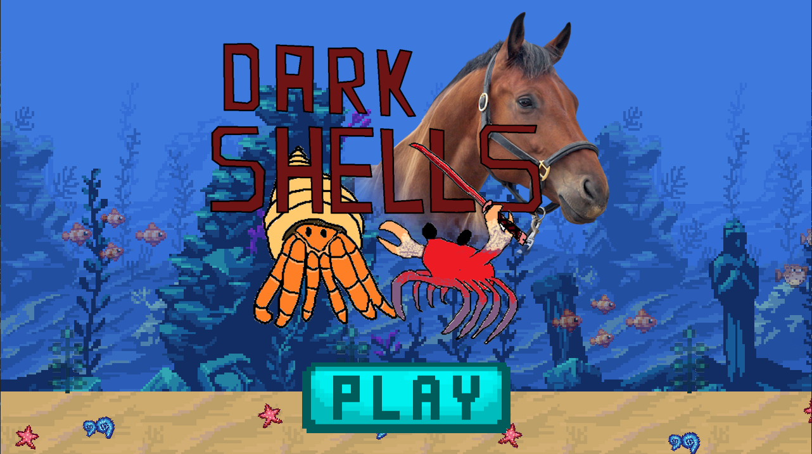
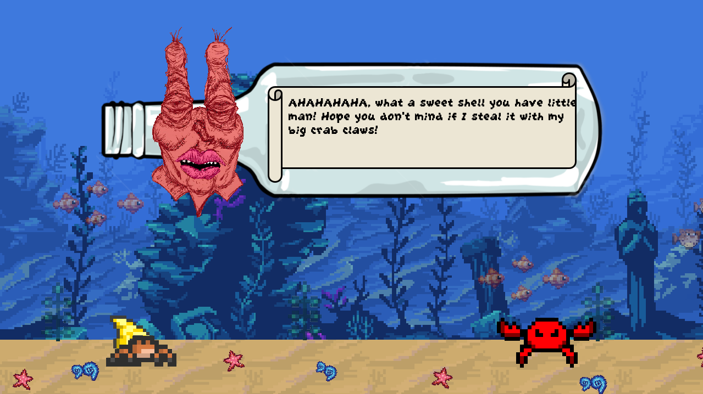
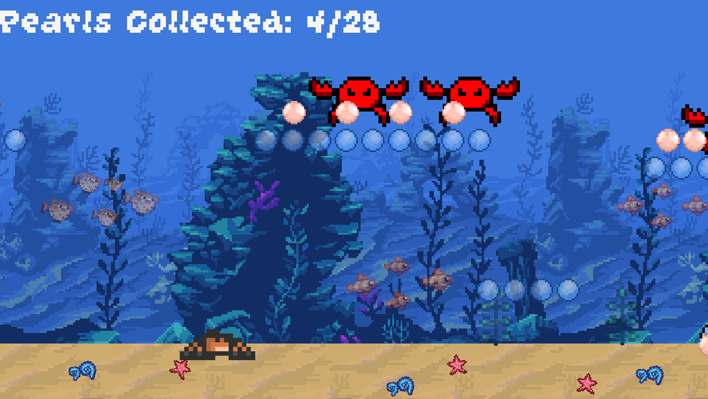
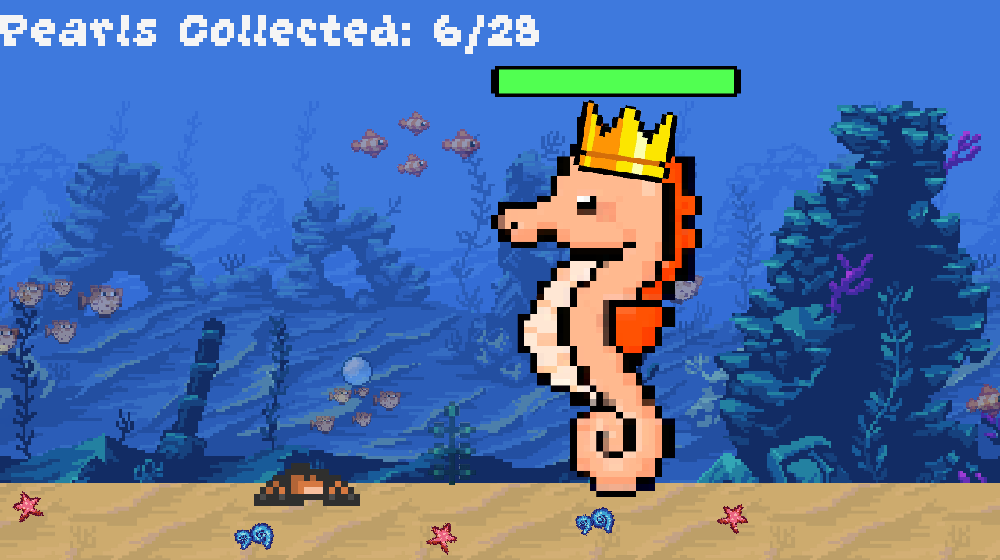
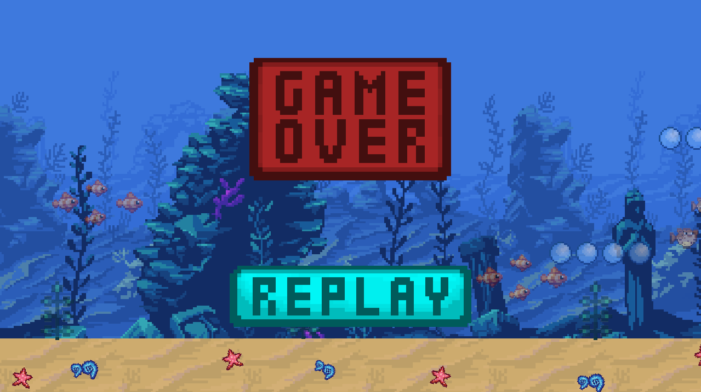

# Dark Shells

Dark Shells is a side-scrolling game developed by **Martin Van Raay**, **Jon McDowell**, **Greg Grondin**, and **Ethan Keating**. This project was created as part of a school assignment and received an outstanding **100% grade** for its quality and storytelling.

## Credits
**Developed by:**
- Martin Van Raay
- Jon McDowell
- Greg Grondin
- Ethan Keating

---

## Screenshots

